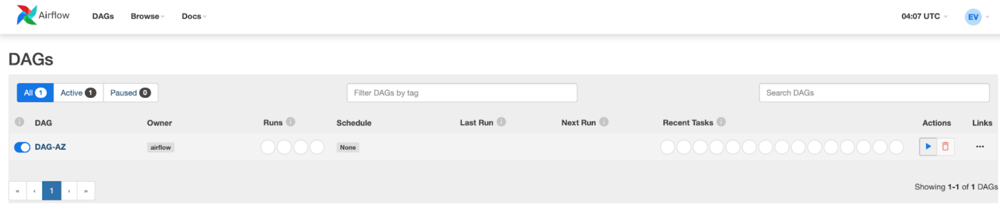
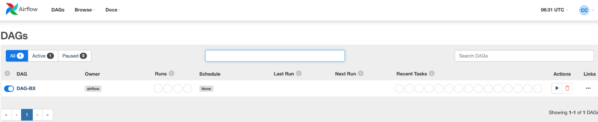
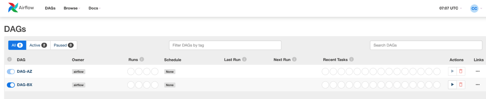

# AIRFLOW RBAC permissions
This POC demonstrate how Cloud Composer administrators can restrict access permissions at the DAG and UI level within Airflow by leveraging the RBAC built-in functionality. 

The first step is to use Cloud IAM to restrict access to the Cloud Composer environment and then go granular (DAG and UI level) with Airflow RBAC.

## Cloud Composer Environment Creation
First ensure that the Cloud Composer API is enabled IN Google Cloud Platform. You can check that by going to the "API & Services" menu and then by accessing to the "Enabled API and Services" submenu. If it's not enabled, you can quickly enable it in the console by looking for the "Cloud Composer API" service and clicking on the "Enable API" button or through the cloud shell with the following command:

```bash
gcloud services enable composer.googleapis.com
```

In case you have a Composer environment already created, skip this step, if not, in order to create one, you can quickly do so by executing the following commands.


<u>**Important**</u>: Before running the following commands, make sure you have the latest gcloud components running this command: `gcloud components update`
```bash

export LOCATION=us-central1
export PROJECT=hip-watch-354806
export PROJECT_NUMBER=722926990090
export IMAGE_VERSION=composer-2.0.14-airflow-2.2.3
export ENVIRONMENT_SIZE=small
export ENVIRONMENT_NAME=env-1
export ADMIN_USER=noliva.academy1@gmail.com
export GROUP_A_USER=nelson.o.valenzuela@gmail.com
export GROUP_B_USER=n3lsok@gmail.com

gcloud projects add-iam-policy-binding ${PROJECT} \
--member serviceAccount:service-${PROJECT_NUMBER}@cloudcomposer-accounts.iam.gserviceaccount.com \
--role roles/composer.ServiceAgentV2Ext

gcloud composer environments create ${ENVIRONMENT_NAME} \
--project=${PROJECT} \
--location=${LOCATION} \
--image-version=${IMAGE_VERSION} \
--environment-size=${ENVIRONMENT_SIZE} \
--airflow-configs=webserver-rbac_user_registration_role=UserNoDags

```

**NOTES**:
* To get PROJECT_NUMBER value, execute the following command:
 
  `gcloud projects list --filter="$(gcloud config get-value project)" --format="value(PROJECT_NUMBER)"`
* Because Cloud Composer 2 uses Workload Identity, the service account of your environment must have bindings to the 
Kubernetes service account that runs your environment's cluster. As part of the commands' execution we add the 
role roles/composer.ServiceAgentV2Ext to the default Cloud Composer service account.
* The option `--airflow-configs=webserver-rbac_user_registration_role=UserNoDags` it is necessary since each GCP user is 
created in Cloud Composer with the "Op" Airflow role by default, which in terms of DAGS, gives you the ability to view, create and delete. 
In order to prevent this role assignment by default, this option change the new user registration role to a role without access to any DAGs. 
In this way, new users do not have access to any DAGs until an Admin assigns a role that has permissions for specific DAGs to their accounts.
`UserNoDags` is a role created by Cloud Composer. It is an equivalent to the User role but without access to any DAGs.

## Grant Apache Airflow Admin role

We are going to designate an Administrator in charge of managing the assignment of roles in Apache Airflow.

```bash
gcloud composer environments run ${ENVIRONMENT_NAME} \
--location=${LOCATION} \
--project=${PROJECT} \
users create -- \
--username ${ADMIN_USER} \
--firstname Bob \
--lastname Dylan \
--role Admin \
--email ${ADMIN_USER} \
--use-random-password
```

## POC Scenario Explanation

There are some requirements to work in a single Cloud Composer instance, where there are multiple teams of Data Engineers, then it is necessary to meet the following conditions.

**Requirements:**
1. Give view and execution access only to Dags where each Data Engineering team has ownership. 
2. Provide view access to Dags to some Data Engineering teams that depend on some processes where they don't have ownership. Just to check the execution status.

Two DAGS will be used in this POC:
- <b><u>DAG-AZ</u></b>: a Bash Airflow Operator that prints a "Hello World! This is DAG-AZ".
- <b><u>DAG-BX</u></b>: a Bash Airflow Operator that prints a "Hello World! This is DAG-BX".

We will be creating two <u>roles</u>:
- <b><u>Role-A</u></b>: which can just <b>view</b> and also <b>execute</b> **DAG-AZ** (Requirement 1).
- <b><u>Role-B</u></b>: which can <b>view</b> and also <b>execute</b> **DAG-BX** (Requirement 1). This role will be able to also <b>view</b> (just view) **DAG-AZ** (Requirement 2).

After having created the two DAGS and ROLES, we will be assigning these ROLES to different users to see the security restrictions applied at the DAG and UI level in action.

## DAGS import to Cloud Composer
- The 2 DAGS we will be using are stored in the following [folder](dags). Open the Cloud Shell and clone the GitHub repo by executing the following command:

```bash
git clone https://github.com/nelson-oliva/apache-airflow.git
```

In order to upload the DAGS to the Cloud Composer DAGS folder, please execute the following command. Please first replace the <u>composer-environment-name</u> tag with the Cloud Composer environment name.

```bash
export DAGS_PATH="/Users/<User>/Develop/apache-airflow/rbac-poc/dags"
gcloud composer environments storage dags import \
--environment ${ENVIRONMENT_NAME} \
--location ${LOCATION} \
--source="${DAGS_PATH}/*"
```

The Python script in this [folder](roles-creation-python-script) will allow an administrator to create or update airflow RBAC roles in order to add / restrict permissions to a Cloud Composer (Airflow) user.

As part of the parameters this Python script receives, you need too specify:
- Airflow URL (--airflow-url): the Airflow web UI URL.
- Role name (--role-name): the name of the role being created or updated.
- Access Token (--access-token): the access token used to securely connect to the Cloud Composer instance.
- DAGS (--dags): list of comma separated values with the name of the DAGS you want to apply the specified permissions.
- Priviligies (--privilegies): specify "read" for read permissions, specify "edit" for edit permissions, specify "delete" for 
delete permissions, specify "create" for create and specify "menu" for menu permissions.

**IMPORTANT**: There are some dependencies that should be installed before the execution.

Located in the root project folder, run the following command:
```bash
pip install -r roles-creation-python-script/requirements.txt
```

## RBAC role creation and user binding

### Requirement 1

By executing the command below we will be creating a role called <b>Role-A</b> which will provide users having it with 
<b><u>read</u></b>,<b><u>edit</u></b>,<b><u>create</u></b>,<b><u>delete</u></b> and <b><u>menu</u></b> permissions on 
the DAGs specified in the DAG list. In this case, DAG-AZ.

```bash
export AIRFLOW_URL=$(echo $(gcloud composer environments describe ${ENVIRONMENT_NAME} \
--location ${LOCATION} \
--project ${PROJECT} | grep airflowUri | awk '{ print $2}'))
export ROLE_NAME="Role-A"
export DAG_LIST="DAG-AZ"
export TOKEN=$(echo $(gcloud auth print-access-token))
export PRIVILEGES=("read" "edit" "create" "delete" "menu")
export SCRIPT_PATH="/Users/<User>/Develop/apache-airflow/rbac-poc/roles-creation-python-script/airflow_rbac_roles.py"

python $SCRIPT_PATH -u "$AIRFLOW_URL" -r "${ROLE_NAME}" -t "${TOKEN}" -d "${DAG_LIST}" -p "${PRIVILEGES[@]}"
```

Now, let's create a new user in Apache Airflow and grant the role.

```bash
gcloud composer environments run ${ENVIRONMENT_NAME} \
--location=${LOCATION} \
--project=${PROJECT} \
users create -- \
--username ${GROUP_A_USER} \
--firstname Eddie \
--lastname Vedder \
--role ${ROLE_NAME} \
--email ${GROUP_A_USER} \
--use-random-password
```

The result in Cloud Composer should be the one depicted below, having DAG-A greyed out (only able to read/view):




By executing the command below we will be creating a role called <b>Consumers-Group-B</b> which will provide users having it with <b><u>read and execute</u></b> permissions on the DAGs specified in the DAG list. In this case, DAG-B.

```bash
AIRFLOW_URL=$(echo $(gcloud composer environments describe ${ENVIRONMENT_NAME} \
--location ${LOCATION} \
--project ${PROJECT} | grep airflowUri | awk '{ print $2}'))
ROLE_NAME="Role-B"
DAG_LIST="DAG-BX"
TOKEN=$(echo $(gcloud auth print-access-token))
PRIVILEGES="read edit"

python3 /Users/nelson.oliva/Develop/apache-airflow/rbac-poc/roles-creation-python-script/airflow_rbac_roles.py \
-u ${AIRFLOW_URL} -r ${ROLE_NAME} -t ${TOKEN} -d ${DAG_LIST} -p ${PRIVILEGES}
```

Now, let's create a new user in Apache Airflow and grant the role.

```bash
gcloud composer environments run ${ENVIRONMENT_NAME} \
--location=${LOCATION} \
--project=${PROJECT} \
users create -- \
--username ${GROUP_B_USER} \
--firstname Chris \
--lastname Cornell \
--role ${ROLE_NAME} \
--email ${GROUP_B_USER} \
--use-random-password
```

The result in Cloud Composer should be the one depicted below, having DAG-B enabled, being able to read and execute:



### Requirement 2

Now, we will be <u>updating</u> the <b>Role-B</b> by running the command again with the changes specified below. We will now specify DAG-AZ in the DAG list, and we will only provide <b><u>read</u></b> permissions for this specific DAG.

```bash
export AIRFLOW_URL=$(echo $(gcloud composer environments describe ${ENVIRONMENT_NAME} \
--location ${LOCATION} \
--project ${PROJECT} | grep airflowUri | awk '{ print $2}'))
export ROLE_NAME="Role-B"
export DAG_LIST="DAG-AZ"
export TOKEN=$(echo $(gcloud auth print-access-token))
export PRIVILEGES=("read")
export SCRIPT_PATH="/Users/nelson.oliva/Develop/apache-airflow/rbac-poc/roles-creation-python-script/airflow_rbac_roles.py"
python ${SCRIPT_PATH} -u ${AIRFLOW_URL} -r ${ROLE_NAME} -t ${TOKEN} -d ${DAG_LIST} -p ${PRIVILEGES[@]}

```

The result in Cloud Composer should be the one depicted below, having DAG-AZ greyed out (only able to read/view), and having DAG-BX enabled, being able to read and execute:


